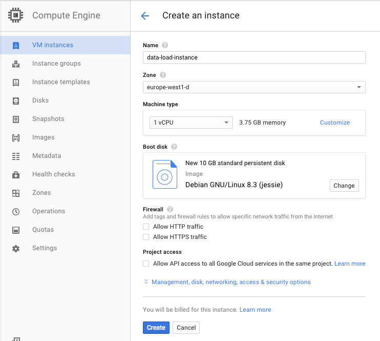

<<<<<<< HEAD
# Data Ingestion II - Load Data from Files to MongoDB

This is the guide for the hands on Session number 6 of the BigData module on BTS Master.
Follow the next steps:
=======
# Data Ingestion II - Data Storing

This is the guide for the hands on Session #6 of the BigData module on BTS Master.
We will load a big amount of data from F¡files to a MongoDB Cluster.

Follow the guide:
>>>>>>> origin/master

### Clone this project on your STS Studio

<<<<<<< HEAD
	git clone https://github.com/djkram/bts-loading-mongo.git
	
Or

	File > Import > Git > Projects from Git > Clone Uri

### Create VMs on Google Cloud 
=======
Clone in terminal

	git clone https://github.com/djkram/bts-loading-mongo.git
	
Clone in STS

	File > Import > Git > Projects from Git > Clone Uri

### Set UP VMs on Google Cloud 
>>>>>>> origin/master

0. Go to: [https://console.cloud.google.com](https://console.cloud.google.com)
0. Create a Project (ex: BTS-BigData)
0. Install GCloud SDK: https://cloud.google.com/sdk/#windows

#### Create MongoDB Cluster
- Go to: Cloud Luncher
- Select MongoDB
- Launch on Computer Engine

- Open port 27017 on the primary instance

##### Configure MongoDB

<<<<<<< HEAD
- Reference documentation: [https://docs.bitnami.com/google/infrastructure/mongodb/](https://docs.bitnami.com/google/infrastructure/mongodb)
- Open SSH:

	gcloud compute --project "<name_project>" ssh --zone "<zone>" "<name_primary-instance-mongo>"
	
or open via Web.

- Create Admin user:

	$ mongo
	> db = db.getSiblingDB('admin')
	> db.createUser( { user: "root", pwd: "YOURPASSWORD", roles: [ "readWriteAnyDatabase", "userAdminAnyDatabase", "dbAdminAnyDatabase", "clusterAdmin" ]} )
	> exit

- Create App Database:
	
	$ mongo admin --username root --password YOURPASSWORD
	> db = db.getSiblingDB('YOUR_DATABASE_NAME')
	> db.createUser( { user: "YOUR_DATABADE_USER", pwd: "YOUR_BD_PASSWORD", roles: [ "readWrite", "dbAdmin" ]} )
	> exit
	
- Remember the User/Password
	

#### Create Data loading instance
- Go to: Compute Engine
- Create Instance

- Open SSH

	gcloud compute --project "<name_project>" ssh --zone "<zone>" "<namer_instance>"
=======
Reference documentation of MongoDB Set up: [https://docs.bitnami.com/google/infrastructure/mongodb/](https://docs.bitnami.com/google/infrastructure/mongodb)

Open SSHin MongoDB cluster primary node:

	$ gcloud compute --project "<name_project>" ssh --zone "<your_zone>" "<name_primary-instance-mongo>"

Example:

	$ gcloud compute --project "bts-test-1210" ssh --zone "europe-west1-d" "mongodbbts-instance-1"
	
or open SSH via Web.

Create admin user (root) in MongoDB:

	$ mongo
	
	db = db.getSiblingDB('admin')
	
	db.createUser( { user: "root", pwd: "YOURPASSWORD", roles: [ "readWriteAnyDatabase", "userAdminAnyDatabase", "dbAdminAnyDatabase", "clusterAdmin" ]} )
	
	exit

Create your own user and database:
	
	$ mongo admin --username root --password SET_YOUR_PASSWORD
	
	> db = db.getSiblingDB('SET_YOUR_DATABASE_NAME')
	
	>db.createUser( { user: "SET_YOUR_DATABADE_USER", pwd: "SET_YOUR_BD_PASSWORD", roles: [ "readWrite", "dbAdmin" ]} )
	
	exit
	
Never user "root" as normal user to access on a database	
Remember the User/Password

#### Create Data loading instance
Go to: Compute Engine
Create Instance

Open SSH

	$ gcloud compute --project "<name_project>" ssh --zone "<zone>" "<namer_instance>"
>>>>>>> origin/master
	
or open via Web.

##### Install dependencies
<<<<<<< HEAD
	sudo apt-get update
	sudo apt-get install openjdk-8-jre

##### Download data
	mkdir data
	cd data
	wget https://s3-eu-west-1.amazonaws.com/eurecat-dataset-historic/twitter/eurecat-bts-dataset-twitter-2015.tar.gz
	tar zxvf eurecat-bts-dataset-twitter-2015.tar.gz
=======
	$ sudo apt-get update
	$ sudo apt-get install openjdk-8-jre

##### Download data
	$ mkdir data
	$ cd data
	$ wget https://s3-eu-west-1.amazonaws.com/eurecat-dataset-historic/twitter/eurecat-bts-dataset-twitter-2015.tar.gz
	$ tar zxvf eurecat-bts-dataset-twitter-2015.tar.gz
>>>>>>> origin/master
	

### Develop your Spring Integration project on STS

- Got to Project: bts-loading-mongo
- Check the Classes on: src/main/java
- Unzip: data/TwitterStream-2015.tar.gz
<<<<<<< HEAD
=======

>>>>>>> origin/master
- Follow the instructions on: src/main/resopurces > META-INF/spring/integration/loading-integration.xml

	<!-- GO TO : https://gist.github.com/djkram/e846ac38fed4f8231cdd -->

	<!-- PASTE HERE: Step 1: Polling Files -->
	<!-- Appears file names on the console ??? -->
	

	<!-- PASTE HERE: Step 2: Message Splitter -->
	<!-- Appears tweets on the console ??? -->

	
	<!-- PASTE HERE: Step 3: MongoDB Loading -->
	<!-- Tweets have been loaded on MongoDB ??? -->
	
<<<<<<< HEAD
- Execute:

	mvn clean instal package
	
- Copy your application in Google Cloud load data instance
 
	gcloud compute copy-files target/bts-loading-mongo-0.0.1-SNAPSHOT.jar data-load-instance:~/

- Open SSH on "data-load-instance"
- Execute Application
 
	java -jar bts-loading-mongo-0.0.1-SNAPSHOT.jar --in.file.path=file:dataeurecat-bts-dataset-twitter

- Check data loading in MongoDB
=======
Build your application using Maven:

in terminal:

	$ mvn clean install package
	
in STS:

	Run AS > Maven Build... > Goals: "clean install package" > Run
	
Copy your application in Google Cloud load data instance
Example:
 
	$ gcloud compute --project "bts-test-1210" copy-files target/demo-load-mongo-0.0.1-SNAPSHOT.jar data-load-instance:~/

Open SSH on "data-load-instance"

	$ gcloud compute --project "bts-test-1210" ssh --zone "europe-west1-d" "data-load-instance"

Execute Application:
 
	$ java -jar bts-loading-mongo-0.0.1-SNAPSHOT.jar --in.file.path=file:dataeurecat-bts-dataset-twitter
	
If you want to run the aplication in backgraund and close the terminal without kill the aplication, you can user "screen"

Example: [http://www.greplinux.net/2013/04/screen-how-to-run-processes-in.html](http://www.greplinux.net/2013/04/screen-how-to-run-processes-in.html)

Check data loading in MongoDB
>>>>>>> origin/master
	
	$ mongo bts --username bts_user -p
	> db.bts.tweets.count()
	
<<<<<<< HEAD
### ADVANCED functionality (optional)
=======
### HOMEWORK

- **Load all the content of the files in your mongoDB Cluster and sent the credentials to the teacher.**
	
### ADVANCED HOMEWORK (optional)
>>>>>>> origin/master

 - Create a Filter who check if the tweet already exist in the DB and avoid the duplicates.
 - See: [http://docs.spring.io/spring-integration/reference/htmlsingle/#filter-xml](http://docs.spring.io/spring-integration/reference/htmlsingle/#filter-xml)
 - See: [http://docs.spring.io/spring-integration/api/org/springframework/integration/core/MessageSelector.html](http://docs.spring.io/spring-integration/api/org/springframework/integration/core/MessageSelector.html)
 - See: [http://www.baeldung.com/queries-in-spring-data-mongodb](http://www.baeldung.com/queries-in-spring-data-mongodb)
