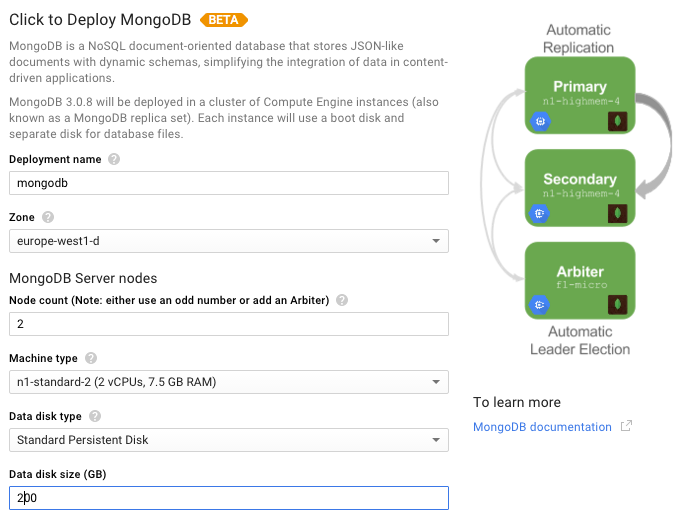
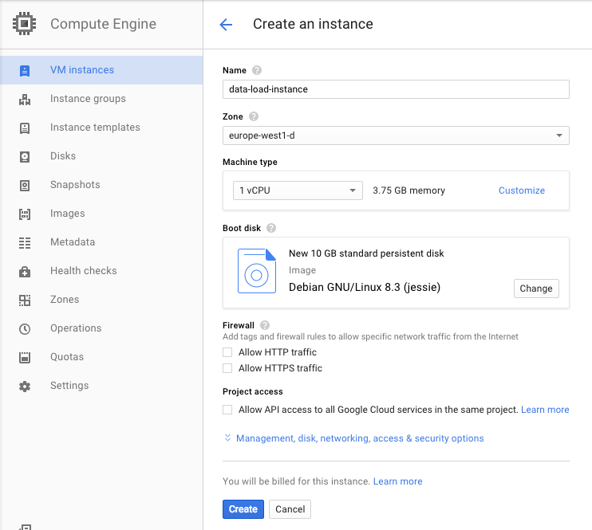

# Data Ingestion II - Load Data from Files to MongoDB

This is the guide for the hands on Session number 6 of the BigData module on BTS Master.
Follow the next steps:

### Clone this project on your STS Studio

	git clone https://github.com/djkram/bts-loading-mongo.git
	
Or

	File > Import > Git > Projects from Git > Clone Uri

### Create VMs on Google Cloud 

0. Go to: [https://console.cloud.google.com](https://console.cloud.google.com)
0. Create a Project (ex: BTS-BigData)
0. Install GCloud SDK: https://cloud.google.com/sdk/#windows

#### Create MongoDB Cluster
- Go to: Cloud Luncher
- Select MongoDB
- Launch on Computer Engine

- Open port 27017 on the primary instance

##### Configure MongoDB

- Reference documentation: [https://docs.bitnami.com/google/infrastructure/mongodb/](https://docs.bitnami.com/google/infrastructure/mongodb)
- Open SSH:

	gcloud compute --project "<name_project>" ssh --zone "<zone>" "<name_primary-instance-mongo>"
	
or open via Web.

- Create Admin user:

	$ mongo
	> db = db.getSiblingDB('admin')
	> db.createUser( { user: "root", pwd: "YOURPASSWORD", roles: [ "readWriteAnyDatabase", "userAdminAnyDatabase", "dbAdminAnyDatabase", "clusterAdmin" ]} )
	> exit

- Create App Database:
	
	$ mongo admin --username root --password YOURPASSWORD
	> db = db.getSiblingDB('YOUR_DATABASE_NAME')
	> db.createUser( { user: "YOUR_DATABADE_USER", pwd: "YOUR_BD_PASSWORD", roles: [ "readWrite", "dbAdmin" ]} )
	> exit
	
- Remember the User/Password
	

#### Create Data loading instance
- Go to: Compute Engine
- Create Instance

- Open SSH

	gcloud compute --project "<name_project>" ssh --zone "<zone>" "<namer_instance>"
	
or open via Web.

##### Install dependencies
	sudo apt-get update
	sudo apt-get install openjdk-8-jre

##### Download data
	mkdir data
	cd data
	wget https://s3-eu-west-1.amazonaws.com/eurecat-dataset-historic/twitter/eurecat-bts-dataset-twitter-2015.tar.gz
	tar zxvf eurecat-bts-dataset-twitter-2015.tar.gz
	

### Develop your Spring Integration project on STS

- Got to Project: bts-loading-mongo
- Check the Classes on: src/main/java
- Unzip: data/TwitterStream-2015.tar.gz
- Follow the instructions on: src/main/resopurces > META-INF/spring/integration/loading-integration.xml

	<!-- GO TO : https://gist.github.com/djkram/e846ac38fed4f8231cdd -->

	<!-- PASTE HERE: Step 1: Polling Files -->
	<!-- Appears file names on the console ??? -->
	

	<!-- PASTE HERE: Step 2: Message Splitter -->
	<!-- Appears tweets on the console ??? -->

	
	<!-- PASTE HERE: Step 3: MongoDB Loading -->
	<!-- Tweets have been loaded on MongoDB ??? -->
	
- Execute:

	mvn clean instal package
	
- Copy your application in Google Cloud load data instance
 
	gcloud compute copy-files target/bts-loading-mongo-0.0.1-SNAPSHOT.jar data-load-instance:~/

- Open SSH on "data-load-instance"
- Execute Application
 
	java -jar bts-loading-mongo-0.0.1-SNAPSHOT.jar --in.file.path=file:dataeurecat-bts-dataset-twitter

- Check data loading in MongoDB
	
	$ mongo bts --username bts_user -p
	> db.bts.tweets.count()
	
### ADVANCED functionality (optional)

 - Create a Filter who check if the tweet already exist in the DB and avoid the duplicates.
 - See: [http://docs.spring.io/spring-integration/reference/htmlsingle/#filter-xml](http://docs.spring.io/spring-integration/reference/htmlsingle/#filter-xml)
 - See: [http://docs.spring.io/spring-integration/api/org/springframework/integration/core/MessageSelector.html](http://docs.spring.io/spring-integration/api/org/springframework/integration/core/MessageSelector.html)
 - See: [http://www.baeldung.com/queries-in-spring-data-mongodb](http://www.baeldung.com/queries-in-spring-data-mongodb)
